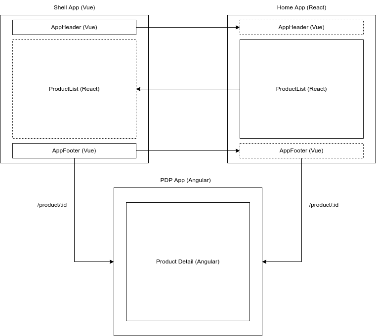

# Multi Framework Microfrontend Example

This repository contain an example of microfrontend with different UI libraries/Frameworks (Vue React and Angular) using Webpack Module Federation.

## Shell App

Shell App is a **Vue** app which will expose common components (i.e. AppHeader and AppFooter), a function to place Vue component on other apps and service to get product list and product detail to be used in other apps.

It will use its own router to serve list (**Home App**) and detail (**PDP App**) pages based on routes.

## Home App

Home App is a **React** app. It will list all products which will be fetched using a service method exposed by shell app.

## PDP (Product Detail Page) App

PDP App is an **Angular** app. It will show product details (image, price, description) which will be fetched using a service method exposed by shell app.

## Block Diagram

